# cmux-agent 작업 계획 개요

## 프로젝트 목적

cmux 기반 멀티 에이전트 플러그인.
cmux workspace 안에서 독립 실행되는 AI CLI들 사이의 메시지를 중개한다.

## 아키텍처 모델

**MSA + Message Queue** 패턴을 따른다.

- 각 AI CLI(Claude Code, Codex CLI, Gemini CLI)는 **독립 마이크로서비스**
- cmux-agent는 **메시지 브로커** — artifact를 감지하고 라우팅
- AI CLI를 감싸거나 stdout을 가로채지 않음
- AI CLI가 결과물(JSON/XML 파일)을 생성하면 **트리거** → 중개

## 시스템 계층 구조

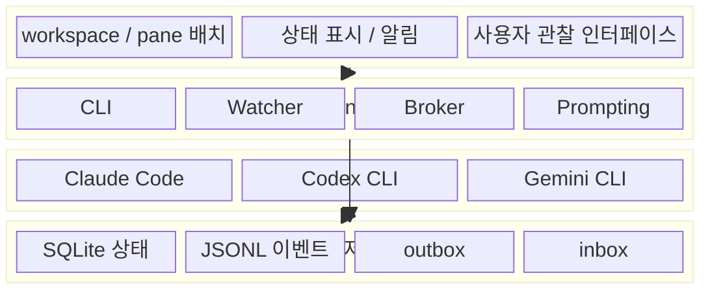

## 핵심 메시지 흐름

orchestrator와 worker 간의 메시지 중개 흐름이다.
AI CLI는 독립적으로 실행되며, cmux-agent는 파일 기반으로 중개만 수행한다.

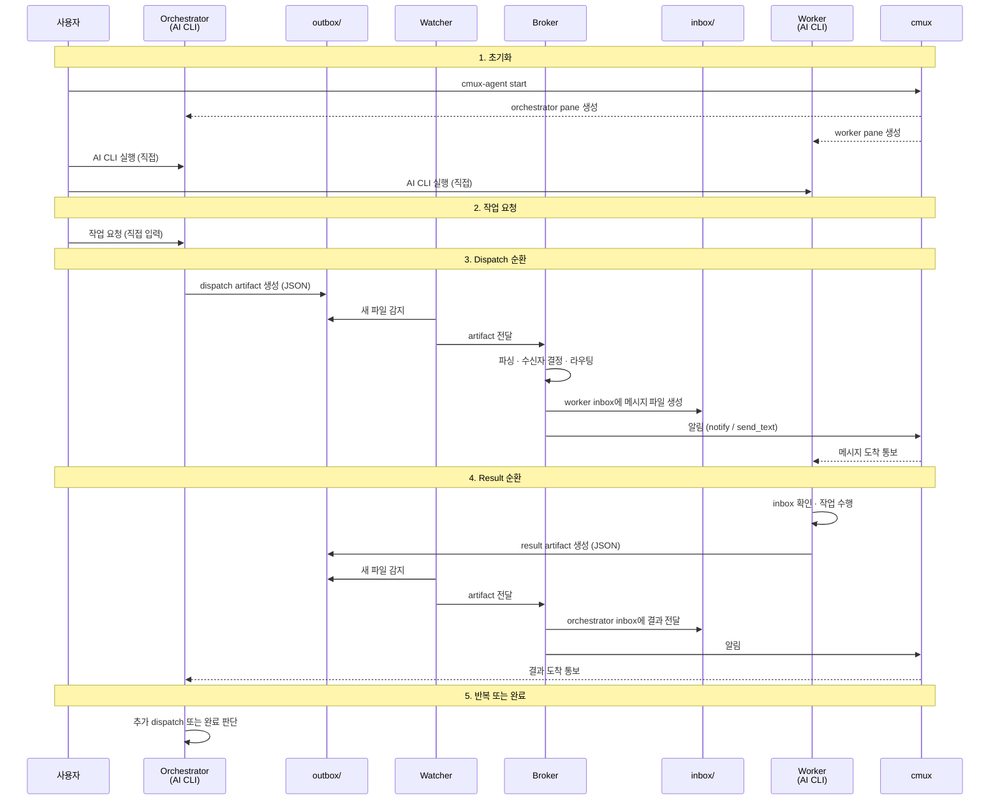

## 컴포넌트 구조

각 모듈의 책임과 의존 관계이다.

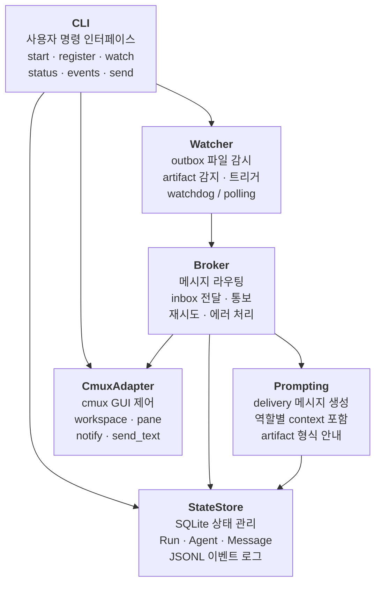

## 데이터 모델

run, agent, message의 관계와 상태 전이이다.

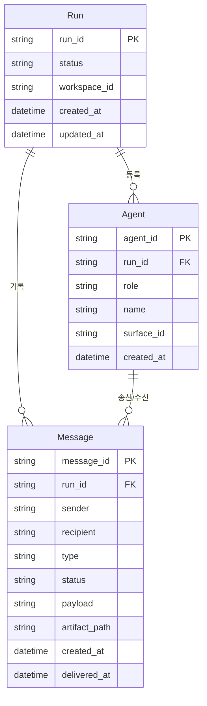

## 상태 전이

### Run 상태

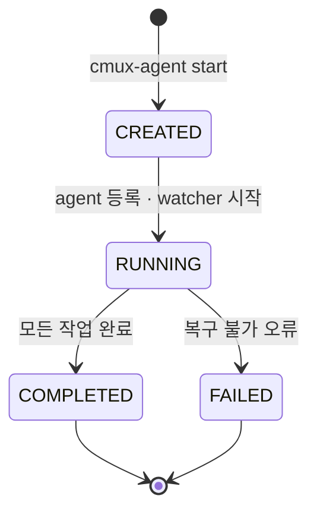

### Message 상태

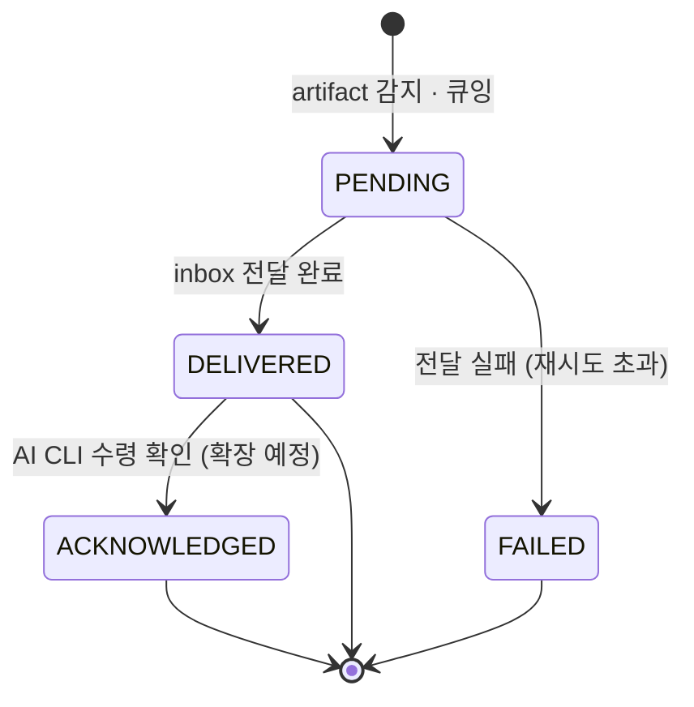

## Artifact 기반 통신 구조

AI CLI와 cmux-agent 사이의 파일 기반 메시지 큐이다.

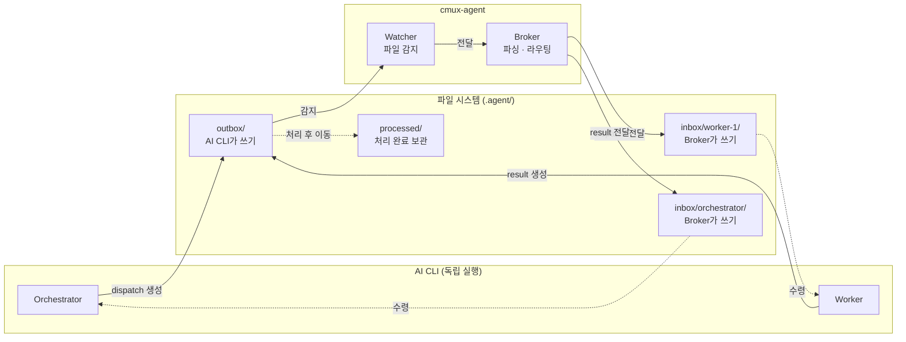

## Watcher → Broker 파이프라인

artifact 감지부터 inbox 전달까지의 상세 흐름이다.

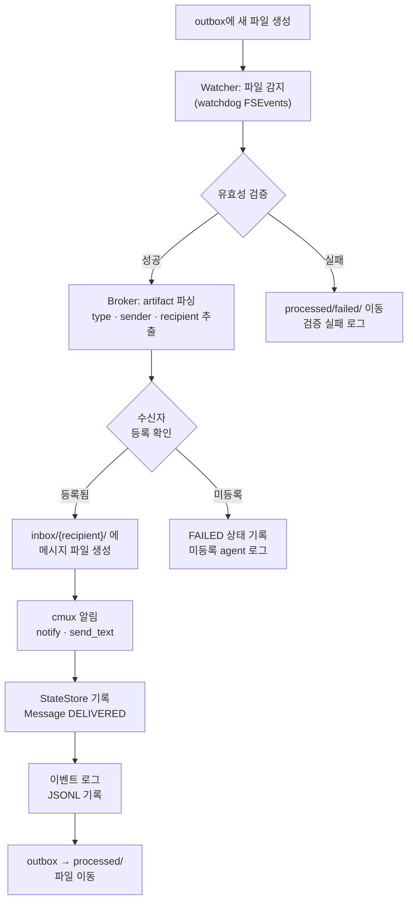

## CLI 명령 구조

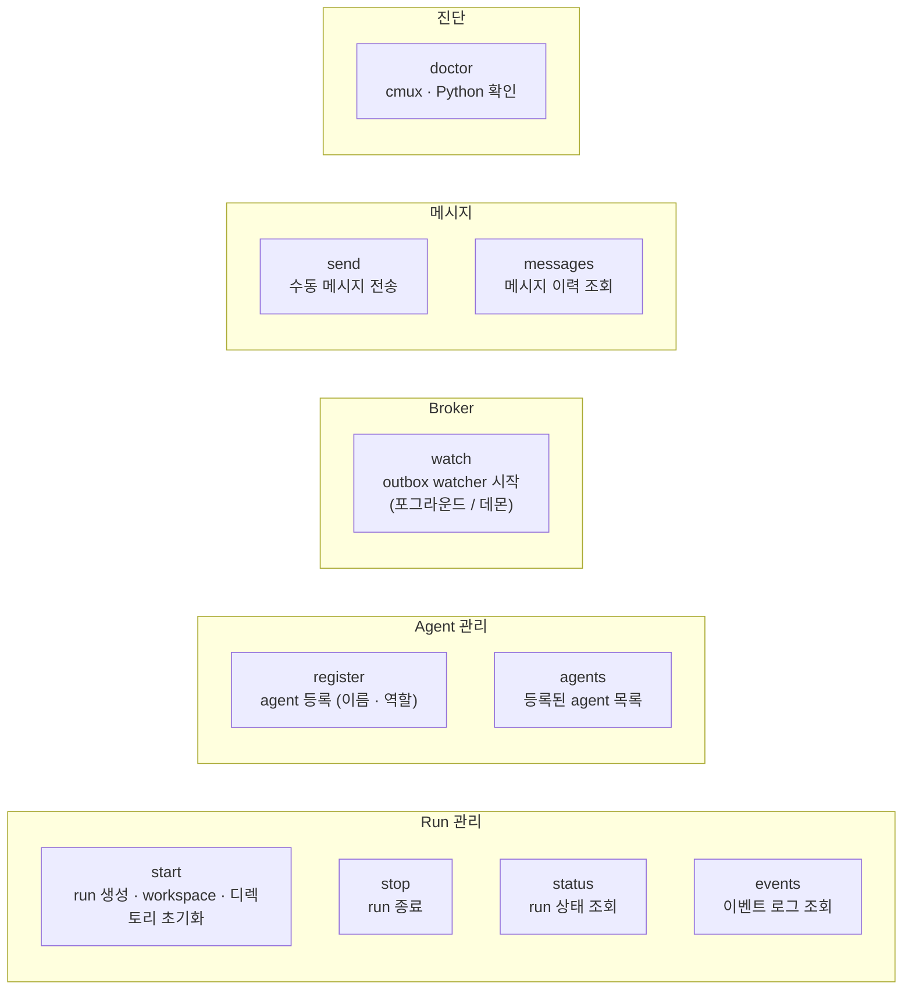

## 디렉토리 구조

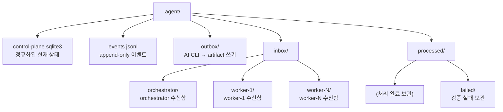

## 구현 의존성 그래프

기능별 작업 계획의 구현 순서와 의존 관계이다.

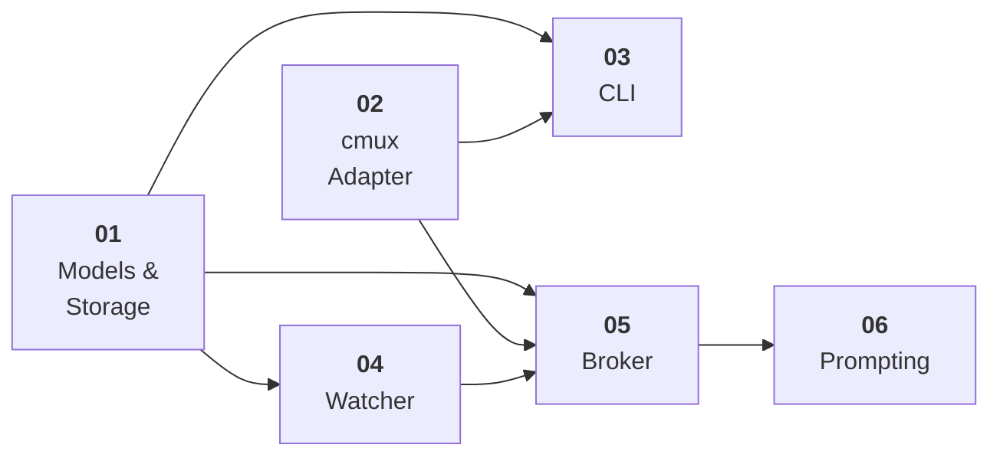

## 기능별 작업 계획

| 순서 | 계획 | 설명 | 의존성 |
| --- | --- | --- | --- |
| 1 | [01-models-storage](./01-models-storage.md) | 데이터 모델, SQLite 상태, JSONL 이벤트, inbox/outbox 구조 | 없음 |
| 2 | [02-cmux-adapter](./02-cmux-adapter.md) | cmux 플러그인 인터페이스 (workspace, pane, 알림) | 없음 |
| 3 | [03-cli](./03-cli.md) | CLI 명령어 (run 관리, agent 등록, 상태 조회) | 01, 02 |
| 4 | [04-watcher](./04-watcher.md) | artifact 감지, 파일 시스템 watcher, 트리거 | 01 |
| 5 | [05-broker](./05-broker.md) | 메시지 브로커, 라우팅, inbox/outbox 큐 관리 | 01, 02, 04 |
| 6 | [06-prompting](./06-prompting.md) | 역할별 prompt 생성, delivery 메시지 포매팅 | 05 |

## 초안 참조

`.draft/` 디렉토리에 3개 영역의 초안이 존재한다. 코드는 재사용하지 않으며, 설계 의도와 아키텍처만 참고한다.

| 영역 | 경로 | 설명 |
| --- | --- | --- |
| CLI Control Plane | `.draft/cli/` | 멀티 에이전트 실행 시스템 MVP 초안 |
| Deep Analysis | `.draft/deep-analysis/` | XML 번들링 + 3단계 점진적 리뷰 |
| Dev Automation | `.draft/dev-automation/` | 7계층 로컬 개발 자동화 워크플로우 |

## 핵심 설계 원칙

- **AI CLI는 독립적**: 감싸지 않고, stdout을 가로채지 않음
- **Artifact 기반 트리거**: 파일 생성 → 감지 → 라우팅 (message queue 패턴)
- **cmux-agent = 브로커**: 메시지를 중개할 뿐, AI CLI의 실행에 개입하지 않음
- **GUI ≠ source of truth**: 상태 기준은 SQLite + JSONL
- **provider 무관**: 어떤 AI CLI든 동일한 artifact 형식으로 통신

## 미구현 / 확장 예정

초안에 설계되었으나 MVP 범위 밖인 영역:

| 영역 | 설명 |
| --- | --- |
| Plan Doc 강제 | Plan Doc 없이 execution 단계로 넘어가지 않도록 gate |
| worktree 격리 | 승인된 writer만 지정 worktree에서 수정 |
| single-writer enforcement | 동시 writer 충돌 방지 |
| review / judge / publish | reviewer 세션, judge 판정, fix loop, publish 권한 분리 |
| approval 흐름 | change class 계산, 승인 필요 여부 판정 |
| gate runner | deterministic gate 실행 (lint, typecheck, test) |
| 복구 / 재진입 | 앱 재시작 후 상태 기반 run 재구성 |
| Deep Analysis | XML 번들링 + 3단계 점진적 코드 리뷰 워크플로우 |
| Dev Automation | 7계층 로컬 개발 자동화 전체 워크플로우 |
